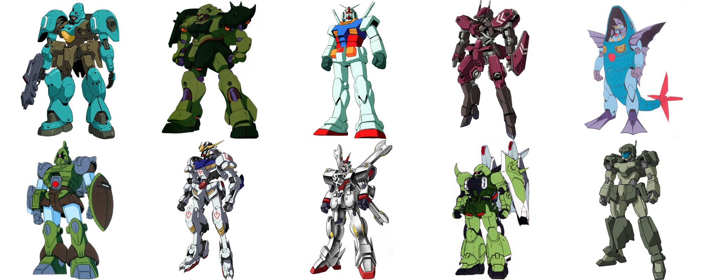
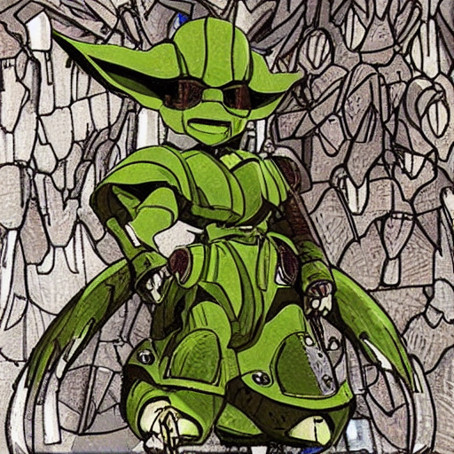
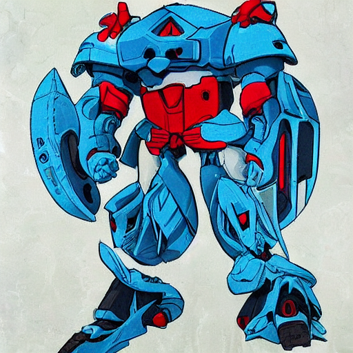
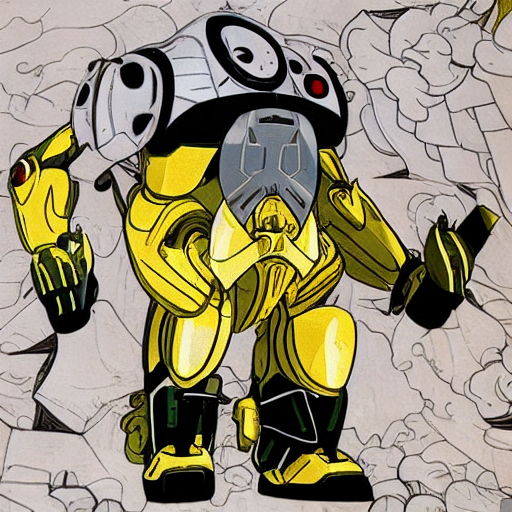
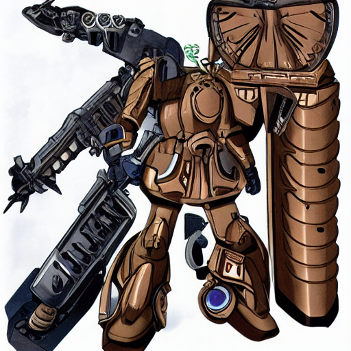
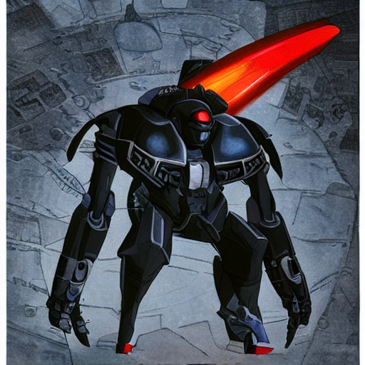
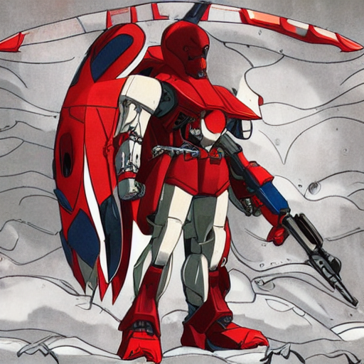

# Stable Diffusion Gundam

Stable-Diffusion fine-tuned on Mobile Suits (Mechas) from the anime franchise Gundam.

Based on [this guide](https://github.com/LambdaLabsML/examples/tree/main/stable-diffusion-finetuning) by LambdaLabs and largely inspired by their Pokemon example.

# Data

Pictures scraped from mahq.net: https://www.mahq.net/mecha/gundam/index.htm

The original Pokemon experiment used [BLIP](https://github.com/salesforce/BLIP) to caption the images automatically, however this did not work very well with this dataset so I only used BLIP to describe the colors and added them to a generic description.

HuggingFace dataset: https://huggingface.co/datasets/Gazoche/gundam-captioned

# Training

Training code at https://github.com/Askannz/stable-diffusion (this is just a fork of justinpinkney/stable-diffusion with some compatibility tweaks applied).

Training took a few hours on an A6000 GPU but overfitted pretty quickly. By epoch ~25 the validation images did not really follow the prompt anymore.

## Trained model weights

https://huggingface.co/Gazoche/stable-diffusion-gundam

## Trained model weights in [diffusers](https://github.com/huggingface/diffusers) format

https://huggingface.co/Gazoche/stable-diffusion-gundam

There are multiple branch revisions, corresponding to the epoch the checkpoint was taken.

The export was done with [this script](https://github.com/Askannz/stable-diffusion/blob/4a2f8479085499a4caedb32d0ba70a5ecf980a77/scripts/convert_sd_to_diffusers.py) and with `--use_ema` enabled.

# Examples

<figure>
  <b>Prompt:</b> <i>Yoda</i>
  
</figure>

<figure>
  <b>Prompt:</b> <i>Smurf</i>
  
</figure>

<figure>
  <b>Prompt:</b> <i>Banana</i>
  
</figure>

<figure>
  <b>Prompt:</b> <i>Steampunk</i>
  
</figure>

<figure>
  <b>Prompt:</b> <i>Darth Vader</i>
  
</figure>

<figure>
  <b>Prompt:</b> <i>Kratos from God Of War</i>
  
</figure>

# Interactive demo

Google Colab Demo: https://colab.research.google.com/drive/11Bdkub4OGtMNdSlMKx4fklB5LAtFFVpG

See the first cell for selecting a model checkpoint.
